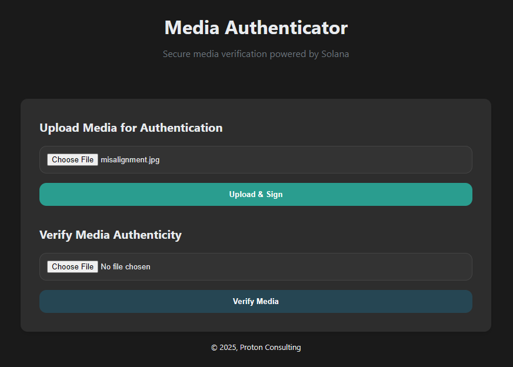

# Media Verifier
This is a prototype of a media verifier system powered by the blockchain.
Anyone can sign media using this tool, which then stores a signed media hash on the Solana blockchain. This media's hash can then later be recomputed using this tool, and anyone can see where the media originated from, via the original signees public wallet address.

# Demo
There is a complete functioning demo (currently only operating on the testnet), which works with both the Phantom browser wallet extension, and inside the Phantom mobile app's browser, it is hosted at https://media-verifier.onrender.com
